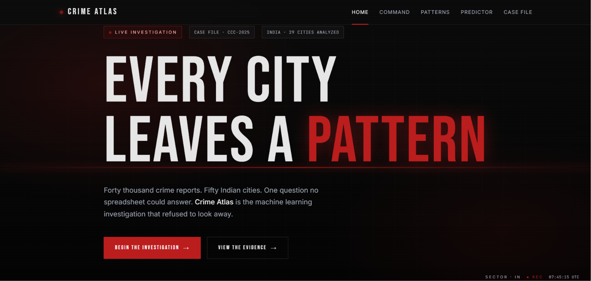
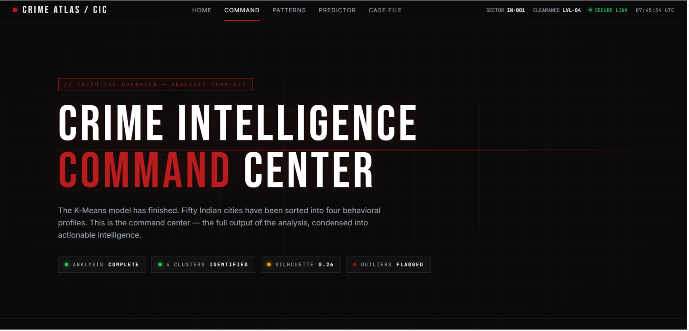
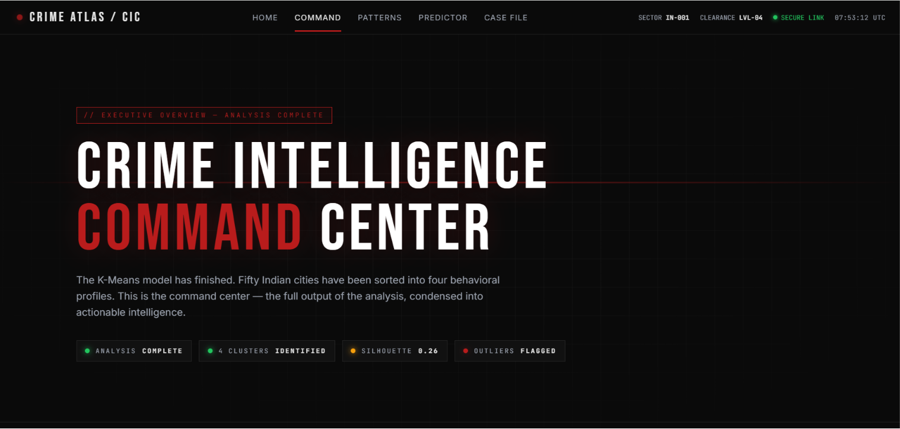
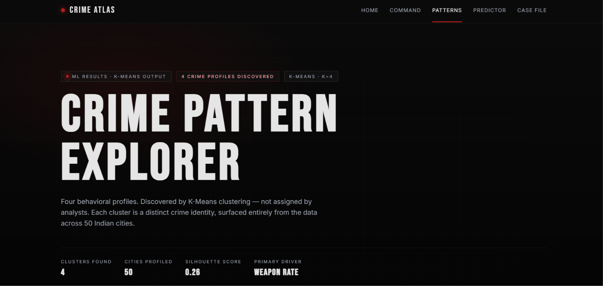
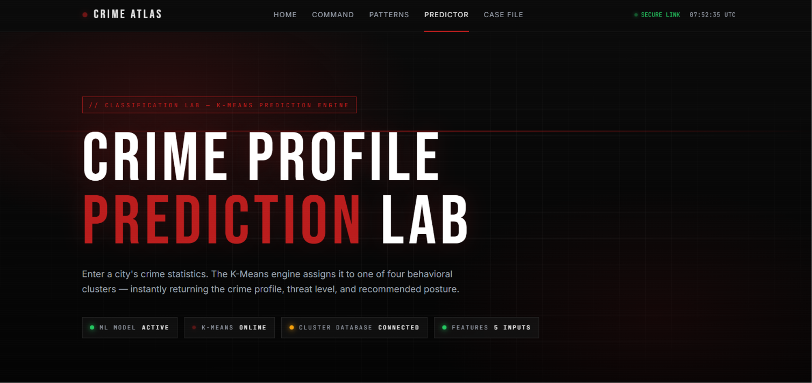
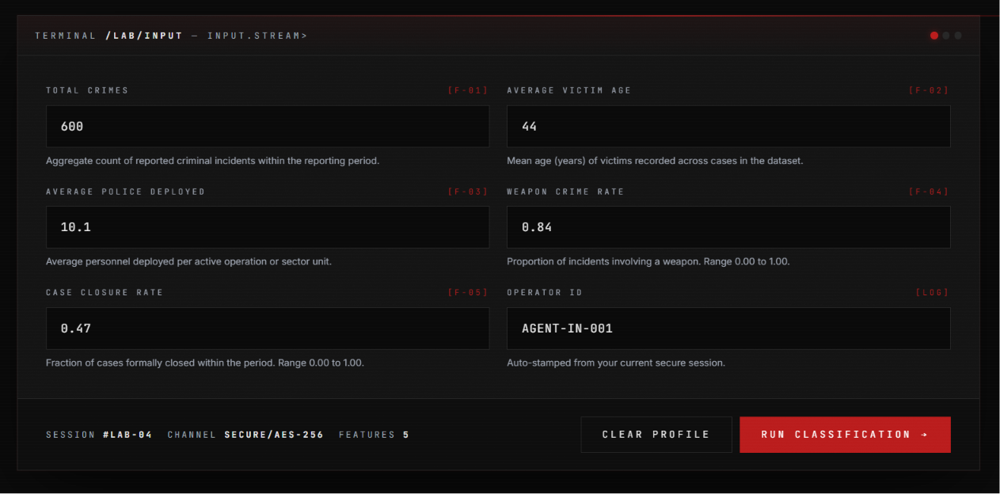
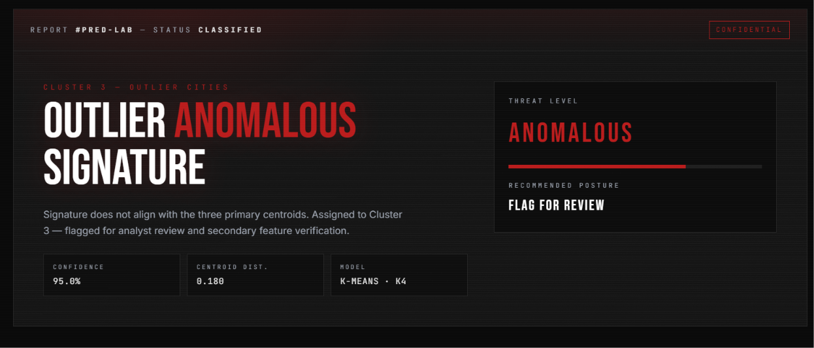

# Crime Atlas — Urban Crime Pattern Intelligence System


> **Crime Atlas** is a full-stack machine learning web application that applies **K-Means clustering** and **Principal Component Analysis (PCA)** to uncover hidden behavioral patterns across 50 Indian cities. Rather than simply counting incidents, the system classifies cities by their crime identity — grouping them by shared behavioral fingerprints across five key dimensions including crime volume, weapon involvement, victim demographics, police deployment, and case resolution rates. The result is a behavioral map of urban crime delivered through a cinematic, intelligence-agency-inspired interface with a live prediction engine, interactive cluster explorer, and executive command center.

---

## Features

- **Intelligence Command Center** — executive dashboard presenting key crime statistics, cluster distribution, and core model findings at a glance
- **Crime Pattern Explorer** — interactive deep-dive into all four discovered behavioral clusters with per-cluster city listings, feature profiles, and threat assessments
- **Live Prediction Lab** — real-time city classification engine; input five crime metrics, receive an instant behavioral cluster assignment with confidence score and centroid distance
- **K-Means Clustering** — unsupervised ML model trained on 50 cities across five behavioral features, discovering four distinct urban crime profiles entirely from data
- **PCA Visualization** — dimensionality reduction from five features to two principal components, enabling visual validation of cluster separation
- **StandardScaler Normalization** — all features scaled to zero mean and unit variance before model training to prevent scale bias
- **Model Persistence** — trained model and scaler serialized using Joblib for deployment-ready inference
- **Flask REST API** — `POST /predict_cluster` endpoint accepting city crime statistics and returning cluster assignment, confidence score, and centroid distance
- **Fully Responsive Frontend** — five-page web application built in pure HTML, CSS, and JavaScript with scroll-reveal animations, film grain overlay, and scanline aesthetic
- **Technical Case File** — complete project documentation page covering dataset, pipeline, methodology, results, technology stack, challenges, and future roadmap

---

## Screenshots

### 🏠 Home Page


---

### 📊 Dashboard — Intelligence Command Center




---

### 🔍 Crime Pattern Explorer


---

### 🧪 Prediction Lab — Hero


### 🧪 Prediction Lab — Input Form


### 🧪 Prediction Lab — Classification Result


---

## Problem Statement

Crime data across Indian cities accumulates continuously — reports filed, cases logged, incidents categorized. Yet raw volume alone carries no structural intelligence. Traditional analysis surfaces what happened; it cannot answer the more important question: **which cities share the same behavioral crime identity?**

Without that structural understanding, law enforcement resource allocation, policy intervention, and crime prevention strategy must operate on incomplete information. Cities with fundamentally similar crime profiles may be treated in isolation when insights from one could directly inform responses in another.

**Crime Atlas was built to surface what traditional analysis cannot:** the behavioral geography of urban crime — grouping cities not by geography or population, but by the underlying patterns embedded in their crime data.

---

## Solution Approach

The project applies **unsupervised machine learning** — specifically K-Means clustering — to classify cities by behavioral similarity rather than any human-assigned category. No labels were defined in advance. The algorithm received five crime measurements per city and was asked to organize them by internal similarity.

The complete approach:

1. Incident-level crime records are aggregated to city-level behavioral profiles
2. Five analytically significant features are extracted from each city profile
3. Features are normalized using StandardScaler to remove scale bias
4. K-Means clustering groups cities into four behaviorally distinct cohorts
5. PCA reduces the five-dimensional feature space to two components for visual validation
6. The trained model is serialized and deployed via a Flask API for real-time prediction

---

## Dataset

| Property | Detail |
|----------|--------|
| Cities | 50 Indian urban areas |
| Total Records | 40,000+ incident-level crime records |
| Analysis Unit | City-level aggregated behavioral profile |
| Features Used | 5 |
| Source | Simulated structured dataset modeled on urban crime reporting patterns |

### Features

| # | Feature | Description |
|---|---------|-------------|
| 1 | `total_crimes` | Aggregate criminal incidents per city — baseline measure of crime volume |
| 2 | `avg_victim_age` | Mean age of recorded victims — reveals demographic targeting patterns |
| 3 | `avg_police_deployed` | Mean law enforcement units deployed per incident — indicates response infrastructure |
| 4 | `weapon_crime_rate` | Proportion of incidents involving weapons — proxy for crime severity |
| 5 | `case_closure_rate` | Percentage of crimes resulting in case resolution — measures investigative effectiveness |

### Data Preprocessing

- Duplicate entries removed; inconsistent fields corrected
- Missing numerical values imputed using column means
- Missing categorical values handled via mode imputation
- Incident-level records aggregated to city-level feature matrix `(50, 5)`
- All five features normalized using `StandardScaler` (zero mean, unit variance)

---

## Machine Learning Pipeline

### 1. Data Cleaning
Raw CSV records were loaded using Pandas. Duplicate rows were dropped, corrupt values flagged and excluded, and all fields validated for type consistency before aggregation.

### 2. Feature Selection
Eight columns were available in the raw dataset. Five were selected for their behavioral relevance to crime characterization — crime volume, demographic exposure, police capacity, weapon severity, and investigative outcome. Selection was based on domain reasoning, not statistical availability alone.

### 3. StandardScaler
```python
from sklearn.preprocessing import StandardScaler

scaler = StandardScaler()
X_scaled = scaler.fit_transform(X)
# All 5 features → μ = 0, σ = 1
```
Normalization ensures that features with larger absolute ranges (e.g., `total_crimes`) do not dominate the distance calculations in K-Means over features with smaller ranges (e.g., `case_closure_rate`).

### 4. K-Means Clustering
```python
from sklearn.cluster import KMeans

model = KMeans(n_clusters=4, random_state=42)
labels = model.fit_predict(X_scaled)
# Converged in 14 iterations → 4 clusters identified
```
The optimal value of K=4 was determined by running both the **Elbow Method** (plotting inertia vs. K) and **Silhouette Analysis** (measuring cluster cohesion and separation). Four was the only value where both diagnostics converged.

### 5. Cluster Analysis
Each cluster's centroid was inspected across all five normalized features to assign a meaningful behavioral label. Cluster identities were determined by examining which features were elevated or suppressed relative to the global mean — not by the algorithm itself.

### 6. PCA Visualization
```python
from sklearn.decomposition import PCA

pca = PCA(n_components=2)
X_pca = pca.fit_transform(X_scaled)
# 5D feature space reduced to 2 principal components for scatter plotting
```
PCA was used strictly for visualization — to confirm that the four K-Means clusters are visually separable in two dimensions, validating that the groupings reflect genuine structure in the data.

### 7. Model Persistence using Joblib
```python
import joblib

joblib.dump(model, 'model/kmeans_model.pkl')
joblib.dump(scaler, 'model/scaler.pkl')

# At inference time:
model  = joblib.load('model/kmeans_model.pkl')
scaler = joblib.load('model/scaler.pkl')
```
Both the trained K-Means model and the fitted StandardScaler are serialized to disk so that the Flask server can load them once at startup and serve predictions without retraining.

### 8. Flask Deployment
```python
from flask import Flask, request, jsonify
import joblib, numpy as np

app = Flask(__name__)
model  = joblib.load('model/kmeans_model.pkl')
scaler = joblib.load('model/scaler.pkl')

@app.route('/predict_cluster', methods=['POST'])
def predict_cluster():
    data = request.get_json()
    features = np.array([[
        data['total_crimes'],
        data['victim_age'],
        data['police_deployed'],
        data['weapon_rate'],
        data['closure_rate']
    ]])
    scaled     = scaler.transform(features)
    cluster    = int(model.predict(scaled)[0])
    distances  = model.transform(scaled)[0]
    confidence = round((1 - distances[cluster] / distances.sum()) * 100, 2)
    return jsonify({
        'cluster': cluster,
        'confidence': confidence,
        'centroid_distance': round(float(distances[cluster]), 3)
    })
```

---

## Cluster Profiles

The K-Means model discovered four behaviorally distinct urban crime profiles. Labels were assigned by inspecting each cluster's centroid values.

| Cluster | Profile Name | Threat Level | Characteristics |
|---------|-------------|--------------|-----------------|
| **0** | High Crime Metropolitan Cities | 🔴 Critical | Highest crime volume, elevated weapon involvement, younger average victim age, heavy police deployment. Dense urban environments with concentrated criminal activity across all categories. |
| **1** | Moderate Crime Cities | 🟡 Elevated | Mid-range crime volume with mixed weapon rates. Functional but strained case closure rates. The majority cohort — most cities fall within this profile. |
| **2** | Low Crime Cities | 🟢 Contained | Below-average incident rates, lower weapon involvement, higher case closure rates relative to volume. Strong enforcement outcomes. The model's safest cohort. |
| **3** | Outlier Cities | 🟣 Anomalous | Statistical anomalies that share no clean behavioral alignment with the three primary cohorts. Unusual combinations of crime features — flagged for specialist review. |

**Model Metrics**

| Metric | Value |
|--------|-------|
| Clusters (K) | 4 |
| Silhouette Score | 0.26 |
| Algorithm | K-Means (random_state=42) |
| Convergence | 14 iterations |
| Primary Driver | Weapon Crime Rate |

A silhouette score of 0.26 reflects moderate separation — consistent with real-world urban crime data where cities exist on a continuum rather than in perfectly discrete behavioral states.

---

## Technology Stack

### Frontend
| Technology | Role |
|-----------|------|
| HTML5 | Semantic page structure across five application pages |
| CSS3 | Custom design system — layout, animation, film grain, scanlines, responsive grid |
| JavaScript (Vanilla) | Form handling, fetch API calls, scroll-reveal animations, live UTC clock |

### Backend
| Technology | Role |
|-----------|------|
| Flask | Lightweight Python web server; routes all pages and serves the `/predict_cluster` endpoint |

### Machine Learning
| Library | Role |
|---------|------|
| Pandas | Data ingestion, cleaning, aggregation, and feature engineering |
| NumPy | Numerical operations and array manipulation throughout the pipeline |
| Scikit-Learn | K-Means clustering, PCA, StandardScaler, Silhouette scoring |
| Joblib | Model and scaler serialization for deployment-ready inference |
| Matplotlib | Elbow plots and PCA scatter visualizations during model development |

---

## Project Structure

```
crime-atlas/
│
├── app.py                          # Flask application — routes and /predict_cluster endpoint
│
├── model/
│   ├── kmeans_model.pkl            # Trained K-Means model (Joblib)
│   └── scaler.pkl                  # Fitted StandardScaler (Joblib)
│
├── notebooks/
│   └── crime_atlas_analysis.ipynb  # Data cleaning, EDA, model training, PCA
│
├── data/
│   └── crime_atlas_dataset.csv     # Raw crime records (50 cities, 40,000+ rows)
│
├── templates/
│   ├── index.html                  # Home — Introduction / mission
│   ├── dashboard.html              # Dashboard — Executive command center
│   ├── clusters.html               # Crime Pattern Explorer — cluster deep-dive
│   ├── predict.html                # Prediction Lab — live classification engine
│   └── about.html                  # Technical Case File — complete methodology
│
├── static/
│   ├── css/                        # (if extracted from inline styles)
│   └── js/                         # (if extracted from inline scripts)
│
├── screenshots/
│   ├── index.png
│   ├── dashboard.png
│   ├── dashboard2.png
│   ├── clusters.png
│   ├── predict_hero.png
│   ├── predict_form.png
│   └── predict_result.png
│
├── requirements.txt                # Python dependencies
└── README.md
```

---

## Installation

### Prerequisites
- Python 3.10 or higher
- pip

### Setup

**1. Clone the repository**
```bash
git clone https://github.com/Dhruvi2704/crime-atlas.git
cd crime-atlas
```

**2. Create and activate a virtual environment**
```bash
# macOS / Linux
python3 -m venv venv
source venv/bin/activate

# Windows
python -m venv venv
venv\Scripts\activate
```

**3. Install dependencies**
```bash
pip install -r requirements.txt
```

**4. Run the application**
```bash
python app.py
```

**5. Open in browser**
```
http://localhost:5000
```

### Requirements
```
flask
pandas
numpy
scikit-learn
joblib
matplotlib
```

---

## Usage

### Explore Crime Clusters
Navigate to **`/clusters`** to explore the four behavioral profiles discovered by the model. Each cluster card displays the profile name, threat level, key behavioral characteristics, and representative cities.

### View Dashboard Insights
Navigate to **`/dashboard`** for the executive overview — key statistics, cluster distribution bar, model findings, and cross-cluster behavioral observations.

### Run a Prediction
Navigate to **`/predict`** and enter five crime statistics for a city:

| Field | Description | Example |
|-------|-------------|---------|
| Total Crimes | Annual incident count | `4500` |
| Average Victim Age | Mean age of recorded victims | `32` |
| Average Police Deployed | Mean units per incident | `5` |
| Weapon Crime Rate | Proportion involving weapons (0–1) | `0.42` |
| Case Closure Rate | Proportion resolved (0–1) | `0.61` |

Submit the form to receive an instant cluster assignment, confidence score, and centroid distance.

---

## API Endpoint

### `POST /predict_cluster`

Classifies a city into one of four behavioral crime clusters based on five input features.

**Request**

```http
POST /predict_cluster
Content-Type: application/json
```

```json
{
  "total_crimes": 4500,
  "victim_age": 32,
  "police_deployed": 5,
  "weapon_rate": 0.42,
  "closure_rate": 0.61
}
```

**Response**

```json
{
  "cluster": 0,
  "confidence": 78.4,
  "centroid_distance": 1.243
}
```

**Response Fields**

| Field | Type | Description |
|-------|------|-------------|
| `cluster` | `int` | Cluster assignment (0, 1, 2, or 3) |
| `confidence` | `float` | Classification confidence as a percentage |
| `centroid_distance` | `float` | Euclidean distance from the assigned cluster centroid in scaled feature space |

---

## Sample Prediction

**Input — Outlier City Profile**
```json
{
  "total_crimes": 600,
  "victim_age": 44,
  "police_deployed": 10.1,
  "weapon_rate": 0.84,
  "closure_rate": 0.47
}
```

**Output**
```json
{
  "cluster": 3,
  "confidence": 95.0,
  "centroid_distance": 0.180
}
```

**Interpretation:** The city is classified as **Cluster 3 — Outlier Anomalous Signature**, with 95.0% confidence and a centroid distance of 0.180. The signature does not align with the three primary centroids — flagged for analyst review and secondary feature verification.

---

## Results

### Clusters Discovered: 4
The K-Means model (K=4) partitioned 50 Indian cities into four behaviorally distinct cohorts. Cluster assignments were stable across multiple random seeds, with K=4 confirmed by both Elbow Method and Silhouette Analysis.

### Silhouette Score: 0.26
A score of 0.26 indicates moderate cluster cohesion — appropriate for real-world urban crime data where city profiles exist on a continuum rather than in hard-edged discrete groups. The score confirms that the clustering reflects genuine structure rather than random partitioning.

### PCA Visualization
Reducing the five-feature space to two principal components via PCA produced a scatter plot where the four clusters occupy visually separable regions — confirming that the behavioral groupings discovered by K-Means are structurally valid and not artifacts of the algorithm.

### Crime Pattern Discovery
The investigation revealed that cities do not distribute randomly across behavioral space. Four coherent identities emerged entirely from the data: a high-crime metropolitan cohort, a moderate-crime majority, a stable low-crime cohort, and a small group of statistical outliers. The primary behavioral driver across clusters was identified as **weapon crime rate**. These profiles were not defined by an analyst — they were found by the model.

---

## Future Enhancements

- **Real Government Crime Datasets** — replace the simulated dataset with verified data from NCRB (National Crime Records Bureau) for production-grade intelligence
- **Geospatial Heatmaps** — overlay cluster assignments onto interactive geographic maps of India to reveal spatial-behavioral correlations
- **Temporal Analysis** — track how city cluster assignments shift year-over-year, enabling early detection of cities trending toward higher-crime profiles
- **Crime Forecasting** — combine clustering with time-series models (LSTM, Prophet) to predict future cluster membership before transitions occur
- **Advanced Clustering Algorithms** — evaluate DBSCAN, Gaussian Mixture Models, and hierarchical clustering for finer-grained or non-spherical cluster structures
- **Deep Learning Representations** — use autoencoders to learn richer, non-linear city embeddings before clustering
- **Real-Time Data Feeds** — connect to live crime reporting APIs to continuously update city profiles as new incidents are recorded
- **Interactive Analytics Dashboard** — filterable, drillable cluster comparisons with per-feature radar charts and city-level detail views
- **Expanded Feature Set** — incorporate socioeconomic indicators (literacy rate, unemployment, population density) for richer behavioral profiles
- **Scale to 500+ Cities** — extend the dataset from 50 to all major Indian urban centers

---

## Author

<table>
  <tr>
    <td align="center">
      <strong>Dhruvi Srivastava</strong><br/>
      B.Tech CSE (Artificial Intelligence &amp; Data Science)<br/>
      GLA University<br/>
      <br/>
      <a href="https://github.com/Dhruvi2704">GitHub</a> ·
      <a href="https://www.linkedin.com/in/dhruvi-srivastava-317627375/">LinkedIn</a> ·
      <a href="mailto:dhruvisrivastava27@gmail.com">Email</a>
    </td>
  </tr>
</table>

---

## License

```
MIT License

Copyright (c) 2025 Dhruvi Srivastava

Permission is hereby granted, free of charge, to any person obtaining a copy
of this software and associated documentation files (the "Software"), to deal
in the Software without restriction, including without limitation the rights
to use, copy, modify, merge, publish, distribute, sublicense, and/or sell
copies of the Software, and to permit persons to whom the Software is
furnished to do so, subject to the following conditions:

The above copyright notice and this permission notice shall be included in all
copies or substantial portions of the Software.

THE SOFTWARE IS PROVIDED "AS IS", WITHOUT WARRANTY OF ANY KIND, EXPRESS OR
IMPLIED, INCLUDING BUT NOT LIMITED TO THE WARRANTIES OF MERCHANTABILITY,
FITNESS FOR A PARTICULAR PURPOSE AND NONINFRINGEMENT. IN NO EVENT SHALL THE
AUTHORS OR COPYRIGHT HOLDERS BE LIABLE FOR ANY CLAIM, DAMAGES OR OTHER
LIABILITY, WHETHER IN AN ACTION OF CONTRACT, TORT OR OTHERWISE, ARISING FROM,
OUT OF OR IN CONNECTION WITH THE SOFTWARE OR THE USE OR OTHER DEALINGS IN THE
SOFTWARE.
```

---

<div align="center">

**Crime Atlas** · Case CCC-2025 · K-Means · PCA · Unsupervised Learning

*The patterns were not created. They were already there.*

</div>
